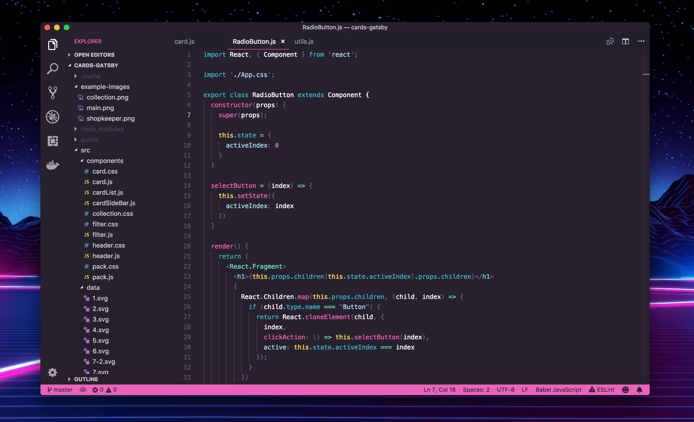

# LaserWave

An clean 80's synthwave / outrun inspired theme for Visual Studio Code.

** *LaserWave Italic* -- now avaliable **

**Currently supports:**
- Python
- Javascript
    - React
- Typescript
    - Angular
- Ruby
- Markdown
- Java
- C#

If you find any missing highlighting or want a new language supported open an issue with an example file from the language and I will get right on it 😀

## Color Scheme

| Color   | Hex         | font-style  | scope |
| ------- |:-----------:|:-----------:|:-----|
| Maximum Blue | #40b4c4 | normal | Keywords, Properties |
| Hot Pink | #EB64B9 | normal | Functions, Attributes, Highlighting |
| Powder Blue | #b4dce7 | normal | Strings |
| African Violet | #b381c5 | normal | Numbers, Types |
| Pearl Aqua | #74dfc4 | normal | Operators, Tags |
| Old Lavender | #91889b | normal | Comments |
| Roman Silver | #716385 | normal | Punctuation |
| Mustard | #ffe261 | normal | Builtins, Constants |
| White | #ffffff | normal | Variables |
| Raisin Black | #27212e | --- | Background |

#### *LaserWave Italic*

Italics include:
  - Keywords
  - Attributes

## Contributing to LaserWave

I'm actively supporting this theme so if you open an issue I will respond 😁! If you would like to contribute to the project that is awesome, just please check out the contribution guidelines in the wiki before submitting a PR.

### Contributors

A special shoutout to the contributors who have helped make LaserWave even better!

- @TGiles
- @cameronstinson4
- @lcatania
